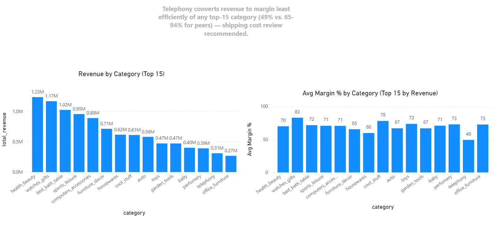
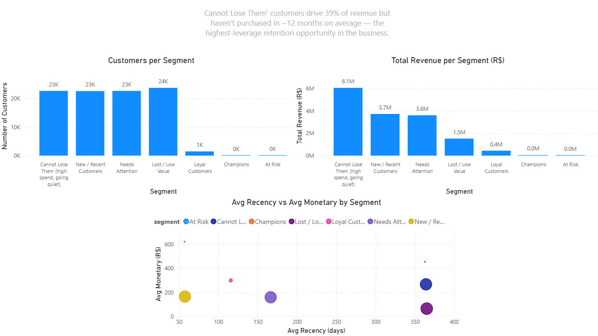

# Olist Profitability & Customer Analysis

An end-to-end analytics project identifying where revenue is being converted into margin least efficiently, and which customers represent the greatest retention risk relative to their value — using PostgreSQL, Python, and Power BI on the [Olist Brazilian E-Commerce dataset](https://www.kaggle.com/datasets/olistbr/brazilian-ecommerce).

## Business Question

*Which product categories and customer segments are quietly underperforming despite looking healthy on the surface — and what should the business do about it?*

## Key Findings

**1. Telephony converts revenue to margin least efficiently of any top-15 category.**

It generates R$309,860 in revenue (14th among 71 categories) but converts only **49.24%** of that into margin after shipping cost — nearly 21 points below the next-lowest top-15 category (housewares, 59.70%) and less than half the efficiency of the strongest performer (computers, 94.33%). Since shipping cost tracks fairly closely with revenue at the category level overall, this gap is unusually specific to telephony and worth a freight-pricing review.

**2. A quarter of customers drive 39.3% of revenue — and they've gone quiet.**

RFM segmentation identified 22,676 customers (24.3% of the customer base) in the **"Cannot Lose Them"** segment, representing higher-value customers with low recency and frequency scores. They contributed R$6.05M in total revenue (39.3% of revenue). Their average recency is **364 days**, indicating that this high-value segment has been inactive for nearly a year. Combined with an average order frequency of just 1.03 across the entire customer base, this indicates that repeat purchasing is relatively limited.

**3. Delivery delay is the strongest predictive signal associated with customer churn — reinforcing Finding 1.**

A churn prediction model (Random Forest, ROC-AUC 0.606, built with recency deliberately excluded from the feature set to avoid data leakage) identified delivery delay as the strongest feature, accounting for **53% of the model's feature importance** — more than five times the importance of total spend or order value. This suggests shipping inefficiency carries both a margin cost (Finding 1) and a customer-retention risk. Model performance is modest in absolute terms and is presented as directional evidence, not a production-ready tool. Full methodology in [`notebooks/04_churn_prediction.ipynb`](notebooks/04_churn_prediction.ipynb).

For the full analysis and recommendations, see the [`Executive Summary`](reports/executive_summary.pdf).

## Business Recommendations

- **Review telephony shipping economics** — investigate freight pricing, packaging weight, and dimensions to identify the source of margin erosion.
- **Launch targeted win-back campaigns** — prioritize high-value inactive customers with long recency before more customer value is lost.
- **Improve delivery reliability** — investigate delivery delays and consider proactive outreach after significantly delayed orders.
  
## Dashboard

**Page 1 — Category Profitability**


**Page 2 — Customer Segmentation**


## Project Structure

```
olist-profitability-analysis/
├── README.md
├── requirements.txt
│
├── data/
│   ├── raw/                      # Original Kaggle CSVs (not tracked in git — see Setup)
│   └── processed/                # RFM segment exports for the dashboard
│
├── sql/
│   ├── 01_schema.sql              # Table definitions, keys, indexes
│   ├── 02_load_data.sql           # \copy commands to load the raw CSVs
│   └── 03_profitability_view.sql  # Margin-proxy view + ranking queries
│
├── notebooks/
│   ├── 01_data_cleaning.ipynb         # Documents and resolves a real FK data issue
│   ├── 02_exploratory_analysis.ipynb  # Order volume, order value, category concentration
│   ├── 03_customer_segmentation.ipynb # RFM scoring and segment analysis
│   └── 04_churn_prediction.ipynb      # Churn model — delivery delay as top predictor
│
├── nlp_query_tool/
│   ├── app.py                     # Streamlit UI
│   └── query_engine.py            # Plain-English question -> SQL -> answer
│
├── dashboard/
│   └── olist_profitability.pbix   # Power BI dashboard (2 pages)
│
└── reports/
    ├── executive_summary.pdf
    └── screenshots/
```

## Tech Stack

- **PostgreSQL** — schema design, relational joins, window functions (`RANK()`), the profitability view
- **Python** (pandas, matplotlib, seaborn, SQLAlchemy) — data cleaning validation, EDA, RFM segmentation
- **scikit-learn** — churn prediction (Logistic Regression, Random Forest)
- **Power BI** — two-page interactive dashboard
- **Streamlit + LLM API** — natural-language query tool over the database (see `nlp_query_tool/`)
- **ReportLab** — executive summary PDF generation

## Setup & Reproduction

1. **Install PostgreSQL** and create a database:
   ```
   psql -U postgres -c "CREATE DATABASE olist_analysis;"
   ```
2. **Download the dataset** from [Kaggle](https://www.kaggle.com/datasets/olistbr/brazilian-ecommerce) and place the CSVs in `data/raw/`.
3. **Run the SQL scripts** in order:
   ```
   psql -U postgres -d olist_analysis -f sql/01_schema.sql
   psql -U postgres -d olist_analysis -f sql/02_load_data.sql
   psql -U postgres -d olist_analysis -f sql/03_profitability_view.sql
   ```
4. **Install Python dependencies** and run the notebooks in order (01 → 02 → 03 → 04):
   ```
   pip install -r requirements.txt
   jupyter notebook
   ```
5. **Open the dashboard**: `dashboard/olist_profitability.pbix` in Power BI Desktop, and point the PostgreSQL connection at your local `olist_analysis` database.

## Methodology Notes & Limitations

- **Margin proxy, not true profit**: Olist's public dataset does not include cost-of-goods-sold or discount data. Margin is approximated as `price − freight_value` per item — a measure of shipping-cost efficiency, not full profitability. This is stated explicitly rather than presented as a true margin figure.
- **RFM monetary value**: Monetary represents total recorded payment value for delivered orders, aggregated at the customer level.
- **Delivered orders only**: all revenue and margin figures exclude non-delivered orders (2.98% of all orders — cancelled, unavailable, still processing, etc.), since these don't represent completed sales.
- **Category translation gaps**: a small number of products (1.36% of total revenue) have category names with no matching English translation in Kaggle's source data. These are excluded from category-level breakdowns rather than guessed at; full detail and the underlying data-quality check are in `notebooks/01_data_cleaning.ipynb`.
- **RFM segment sizes reflect the dataset's buying pattern**: because most Olist customers are one-time buyers, segments requiring high frequency (e.g. "Champions") are naturally small. This is a real characteristic of the business, not a modeling flaw — noted directly in `notebooks/03_customer_segmentation.ipynb`.

## Author

Aicha Ajdid — [LinkedIn](https://linkedin.com/in/aicha-ajdid-50836626b) · [GitHub](https://github.com/AICHAAAAH)
